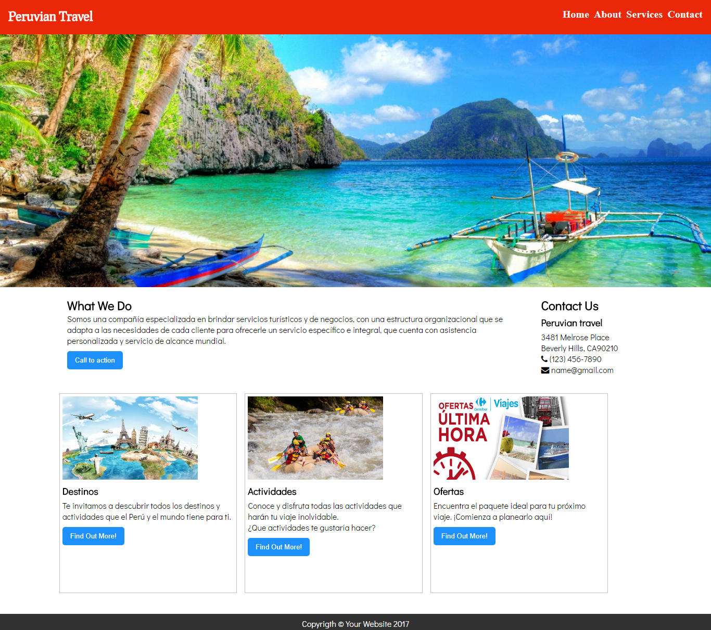

# Reto de Codigo
## Mi pagina
OBJETIVO  
Crear una pagina web responsive usando grillas.  
CONTENIDO  
Se elaboro una pagina web de una agencia de viajes y turismo.  
La pagina se realizo haciendo uso de los conocimientos aprendidos en clase sobre css y html.  
Se uso grillas de 12 columnas.

Desarrolladora:
Elizabeth Segura
